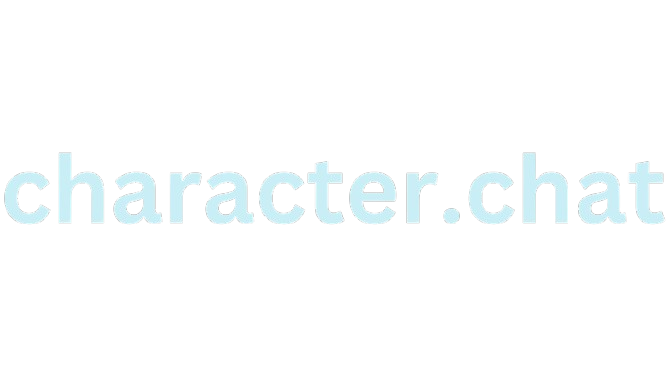

# Character.Chat
## "A fully local alternative to Character.AI"

As of the following weeks, character.ai has slowly degraded in quality. It's community is in outrage over new features, filters are going crazy, and more.
Character.Chat fixes that. This is a fully local implementation, a barebones system, of what I've been working on.

## Setup: 
Since most of you don't even care about the backstory, let's get into the basics- Installation!

To build from source (If you're paranoid about the releases), just clone the repo and run `go build ./` in the directory.

For everyone else, download the latest release, and enjoy!

##### This app requires **Ollama**, an AI model loader.

## Roadmap:
- [x] Character Creation Support
- [x] Windows Support
- [x] Multi-LLM Support
- [-] Character Storage 

## Background Information:
*In a galaxy far, far away, a man lay-* Shut up. **NERD!**

This is a really shitty remake of an old system I made in Python, so be warned... the code is ass.

Initially made to revert the changes made with Character.AI's recent updates, this app is packed in with a few features which make it a great competitor.

I'm planning on adding in more, such as automatic updating and enhanced character creation, but it's simply not going to happen until I get better at Golang.

If you find a bug, report it in Eclipse Studios, and that's all from me. Enjoy!

## Contacts:

* Eclipse Studios - [Discord Link](https://discord.gg/zBvUqbahdb)
* Youtube Channel - [Youtube Link](https://youtube.com/@SpaceReii)

## Quotes
* My Mother: *"Bu Bu Bu"* (I have no fucking idea what she's on)
* x_z3n: *"if you don't have to, do NOT use Java"*
* Puro: *"IT WAS A MISSCLICK I SWEAR!"*
* SpvceR3ii: *"hippity hoppity your code is now my property"*